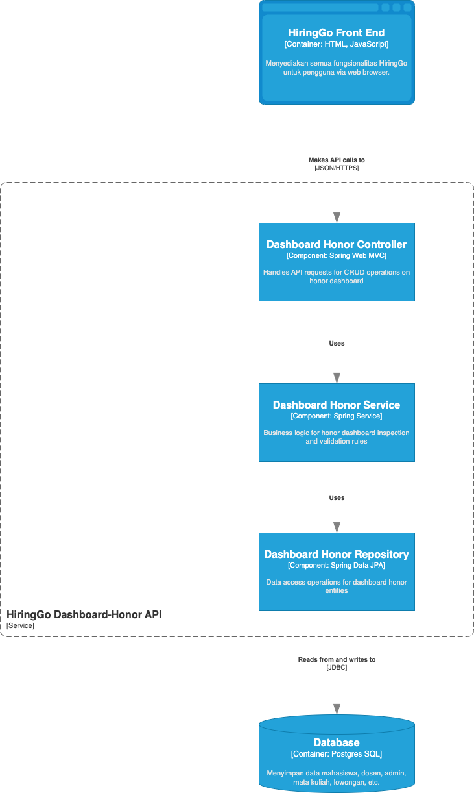
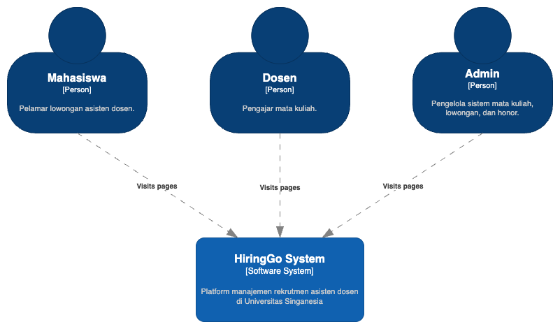
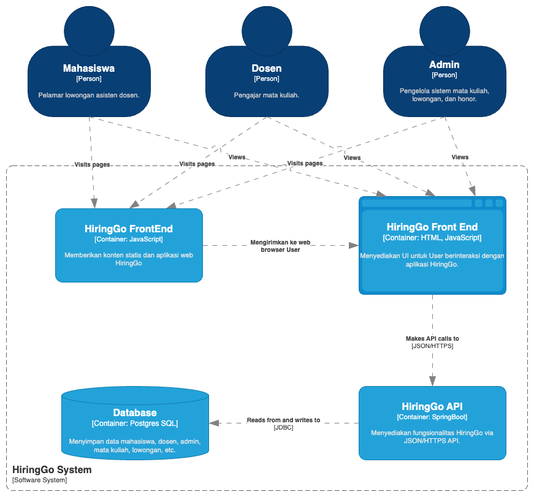
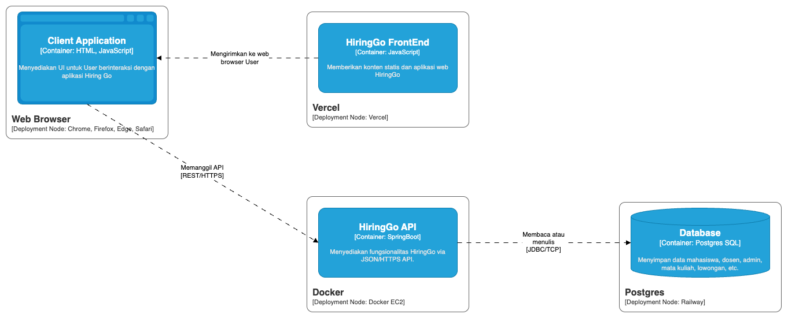
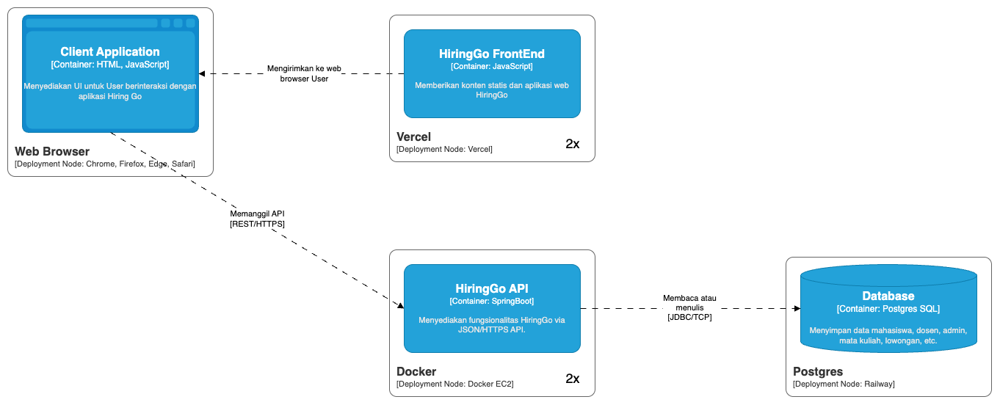
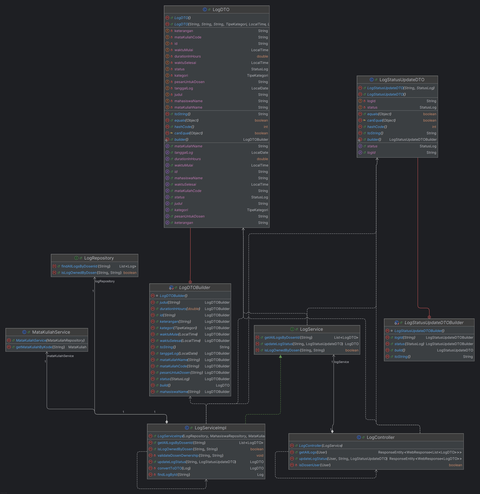
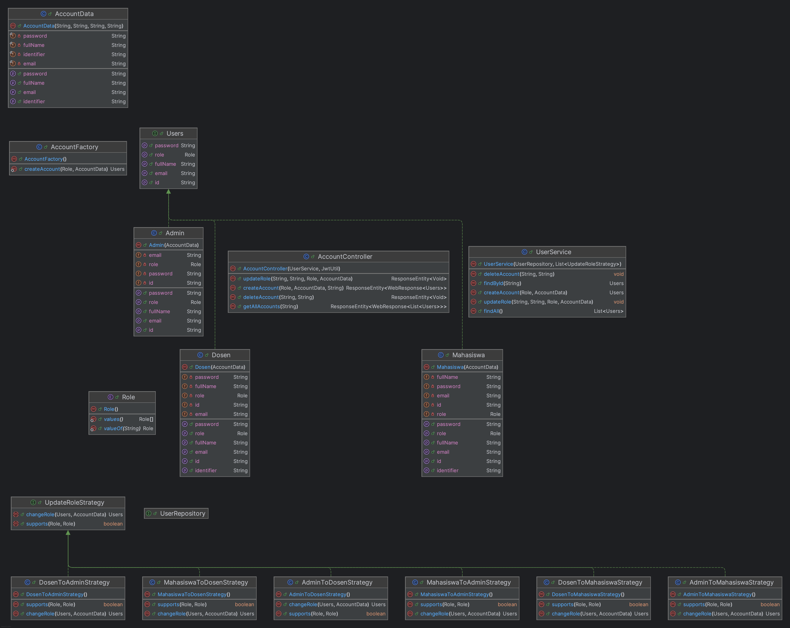
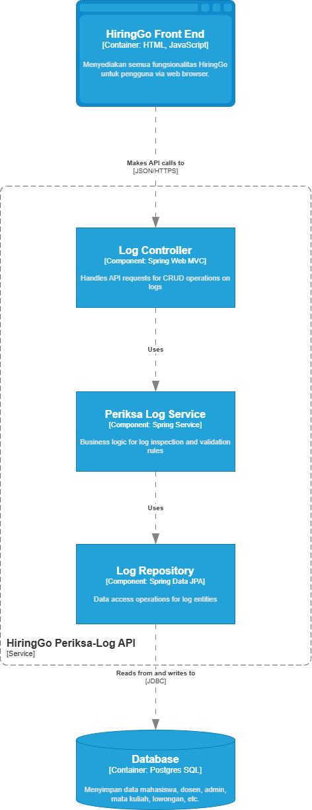
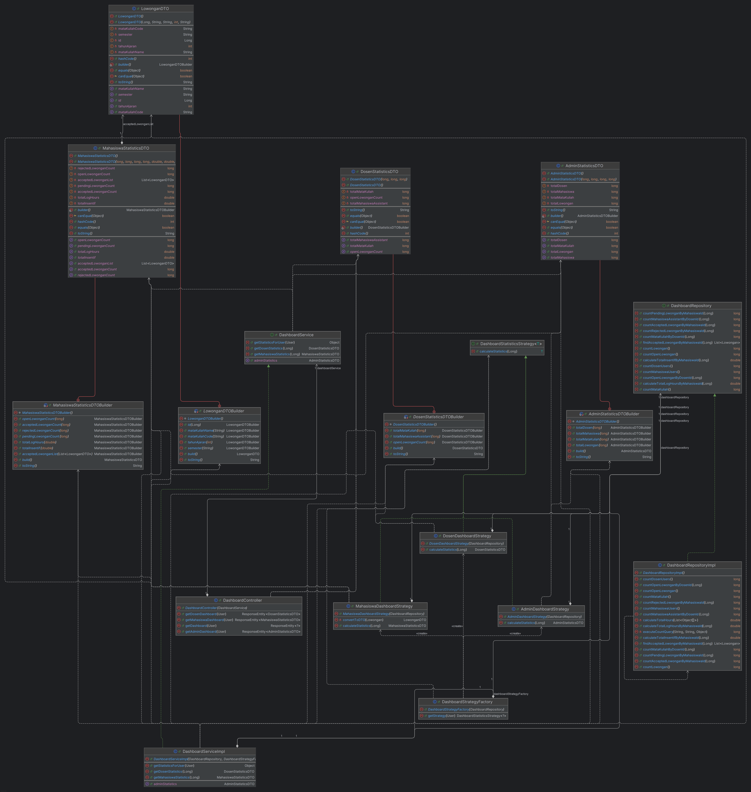
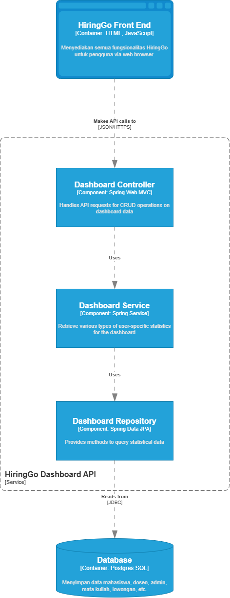

# MODULE 9
### Component Diagram

# A04 HiringGo

## Currect Architecture

### Context Diagram

### Container Diagram

### Deployment Diagram

## Future Architecure
Saat ini aplikasi kami menggunakan arsitektur monolitik, di mana seluruh komponen backend dijalankan dalam satu aplikasi besar.

Berdasarkan hasil diskusi Risk Storming, beberapa risiko yang kami identifikasi dari arsitektur monolitik saat ini adalah:

1. Risiko bottleneck pada aplikasi monolitik
   Jika pengguna aplikasi meningkat secara drastis, maka performa dapat menurun akibat beban berlebih pada satu node aplikasi tunggal.
2. Single Point of Failure (SPOF)
   Jika aplikasi tunggal ini mengalami kegagalan, maka seluruh layanan akan terhenti karena tidak ada node cadangan yang siap menangani permintaan pengguna.
3. Downtime saat deployment dan maintenance
   Setiap perubahan atau maintenance memerlukan deployment ulang yang menyebabkan downtime, sehingga pengguna terganggu.

Untuk mengatasi risiko tersebut, kami memilih pendekatan tetap menggunakan arsitektur monolitik namun dengan horizontal scaling. Hal ini berarti bahwa:

1. Aplikasi monolitik tetap dijalankan dalam satu codebase tunggal, namun di-deploy dalam beberapa node secara bersamaan.
2. Beban pengguna akan didistribusikan ke node-node aplikasi yang berbeda menggunakan load balancer.
3. Ketika terjadi lonjakan trafik atau kebutuhan tinggi, node baru dapat ditambahkan secara cepat untuk menangani peningkatan permintaan.
4. Jika salah satu node mengalami kegagalan, load balancer akan otomatis mengalihkan permintaan pengguna ke node lain yang masih aktif, sehingga SPOF teratasi.

Strategi ini memungkinkan kami menjaga stabilitas aplikasi, meningkatkan ketersediaan layanan, dan meminimalkan downtime aplikasi sekaligus menjaga kompleksitas pengelolaan tetap rendah dibandingkan dengan microservices.

### Future Deployment Diagram

## Why Risk Storming?
Kami menggunakan teknik Risk Storming untuk membantu tim mengidentifikasi dan memahami risiko-risiko utama yang mungkin terjadi pada arsitektur aplikasi kami yang saat ini masih berbentuk monolitik. Melalui diskusi ini, kami menemukan beberapa risiko penting seperti potensi bottleneck ketika trafik meningkat, adanya single point of failure (SPOF), serta downtime saat proses deployment atau maintenance. Dengan memahami risiko-risiko ini sejak awal, kami dapat menyusun strategi mitigasi yang tepat tanpa harus langsung berpindah ke arsitektur microservices yang lebih kompleks. Salah satu keputusan yang kami ambil adalah melakukan skala horizontal terhadap aplikasi monolitik, dengan men-deploy beberapa instance aplikasi yang didistribusikan melalui load balancer. Pendekatan ini membantu meningkatkan ketersediaan layanan dan performa aplikasi, sekaligus menjaga arsitektur tetap sederhana. Risk Storming menjadi langkah penting dalam proses perencanaan ini karena membantu tim mengambil keputusan berbasis risiko, dengan pertimbangan teknis yang lebih matang dan terdokumentasi dengan baik.

### Rahardi Salim

### Periksa Log

### Container Diagram

### Code Diagram

### Dashboard

### Container Diagram

### Code Diagram
